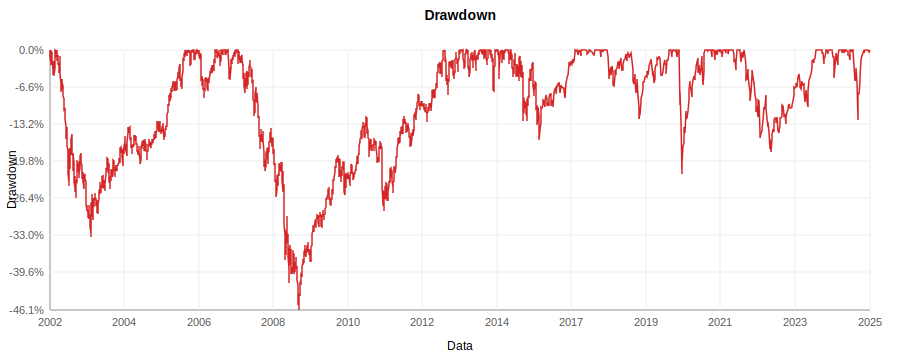
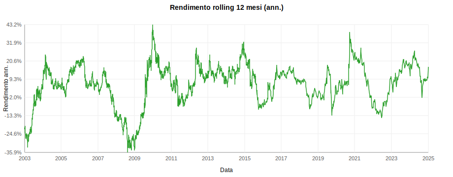
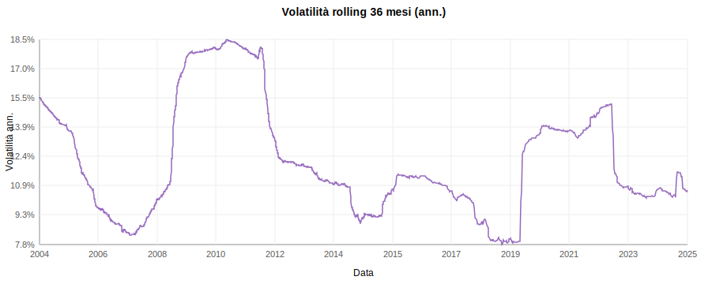

# Allianz Insieme – Linea Azionaria: Analisi

Periodo: 2002-01-02 → 2025-08-13  
Osservazioni: 3982

## Metriche principali

- Rendimento cumulato: 185.81%
- CAGR: 4.55%
- Rendimento ann. (approx aritmetico): 5.24%
- Rendimento ann. (comp. continuo): 4.55%
- Volatilità ann.: 12.59%
- Sharpe (rf=0): 0.42
- Sortino (rf=0): 0.43
- Max drawdown: -46.15%
- Calmar: 0.10
- VaR(95%) giornaliero: -1.10%

Nota: la frequenza dei dati è mista (giornaliera → settimanale). Le metriche sono calcolate con stime time-weighted robuste a campionamenti irregolari.

## Rendimenti trailing

Periodo | Totale | CAGR
---|---|---
1 anni | 16.82% | 16.82%
3 anni | 38.31% | 11.42%
5 anni | 58.69% | 9.68%
10 anni | 93.05% | 6.80%

## Rendimento per anno

Anno | Rendimento
---|---
2003 | 6.18%
2004 | 4.84%
2005 | 19.88%
2006 | 5.92%
2007 | -2.89%
2008 | -34.77%
2009 | 22.28%
2010 | 15.15%
2011 | -4.50%
2012 | 10.19%
2013 | 17.56%
2014 | 15.92%
2015 | 6.43%
2016 | 3.04%
2017 | 13.16%
2018 | -8.19%
2019 | 16.37%
2020 | 5.85%
2021 | 19.38%
2022 | -14.68%
2023 | 15.25%
2024 | 17.67%
2025 | 7.43%

## Grafici

