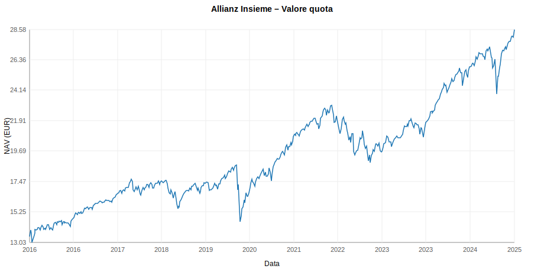
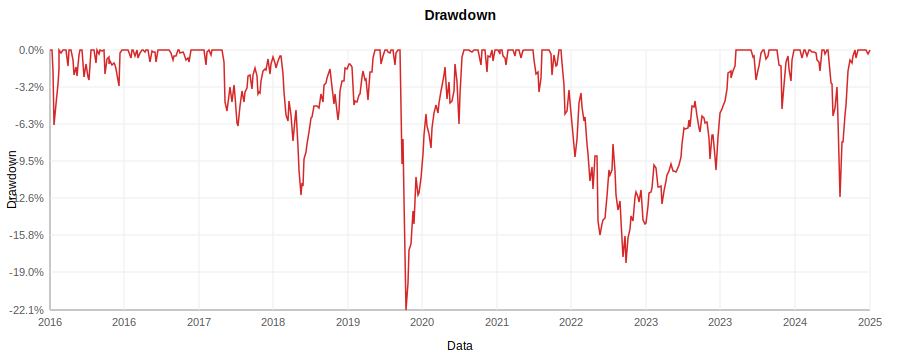
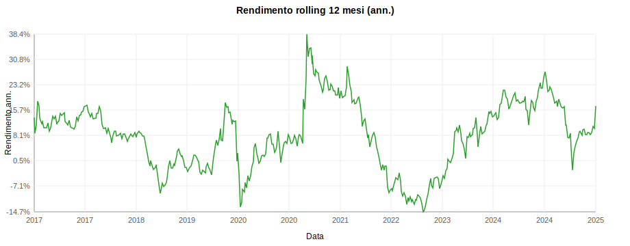
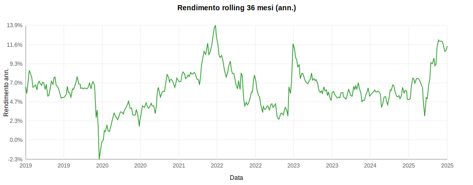
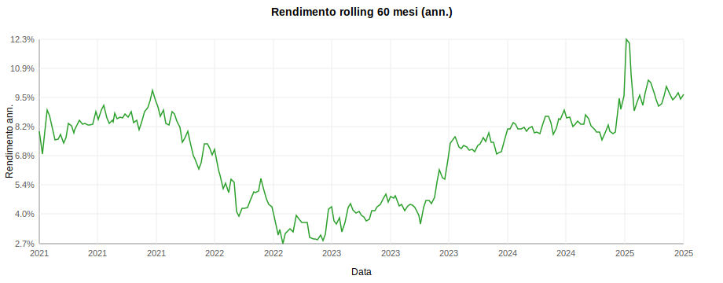
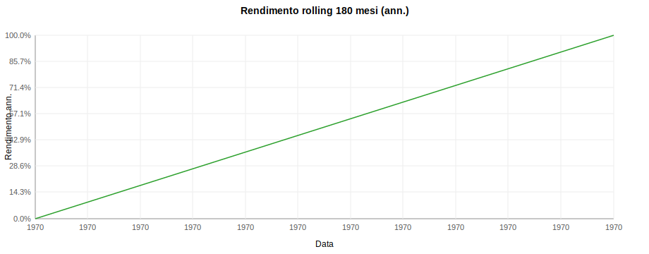
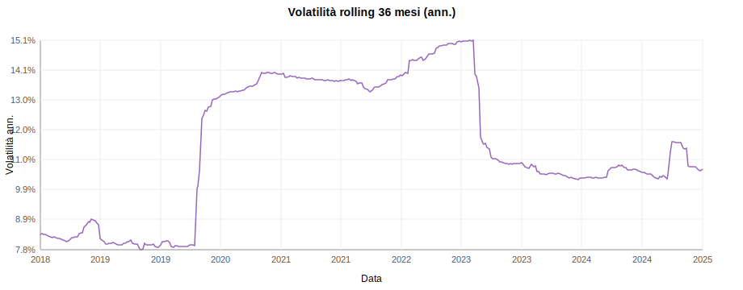
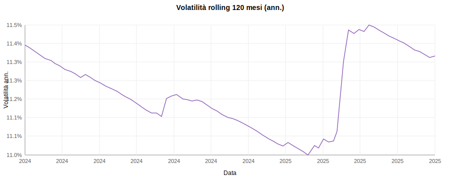

# Allianz Insieme – Linea Azionaria: Analisi

Periodo: 2016-01-20 → 2025-08-13  
Osservazioni: 507

## Metriche principali

- Rendimento cumulato: 112.85%
- CAGR: 8.22%
- Rendimento ann. (approx aritmetico): 8.54%
- Rendimento ann. (comp. continuo): 8.22%
- Volatilità ann.: 11.37%
- Sharpe (rf=0): 0.75
- Sortino (rf=0): 0.79
- Max drawdown: -22.12%
- Calmar: 0.37
- VaR(95%) giornaliero: -0.32%

Nota: la frequenza dei dati è mista (giornaliera → settimanale). Le metriche sono calcolate con stime time-weighted robuste a campionamenti irregolari.

## Rendimenti trailing (alla data più recente)

Periodo | Totale | CAGR
---|---|---
1 anni | 16.82% | 16.82%
3 anni | 38.31% | 11.42%
5 anni | 58.69% | 9.68%
10 anni | n/d | n/d
20 anni | n/d | n/d

## Rendimenti trailing al 2025-08-13

Periodo | Totale | CAGR
---|---|---
1 anni | 16.82% | 16.82%
3 anni | 38.31% | 11.42%
5 anni | 58.69% | 9.68%
10 anni | n/d | n/d
20 anni | n/d | n/d

## Probabilità di successo (rendimento > 0)

Periodo | Finestre | Successi | Probabilità
---|---:|---:|---:
1 anni | 451 | 346 | 76.7%
3 anni | 345 | 342 | 99.1%
5 anni | 241 | 241 | 100.0%
10 anni | 0 | 0 | n/d
15 anni | 0 | 0 | n/d
20 anni | 0 | 0 | n/d

## Analisi alla data più recente

Periodo | Vol. ann. | Vol. negativa ann. | Sharpe | Sortino
---|---|---|---|---
1 anni | 12.54% | 11.89% | 1.28 | 1.35
3 anni | 10.63% | 9.16% | 1.07 | 1.24
5 anni | 10.80% | 8.74% | 0.91 | 1.12
10 anni | 11.37% | 10.77% | 0.75 | 0.79
20 anni | n/d | n/d | n/d | n/d

## Grafici

### Rendimenti rolling (annualizzati)

### Volatilità rolling (ann.)

## Rendimento per anno

Anno | Rendimento
---|---
2017 | 13.16%
2018 | -8.19%
2019 | 16.37%
2020 | 5.85%
2021 | 19.38%
2022 | -14.68%
2023 | 15.25%
2024 | 17.67%
2025 | 7.43%
